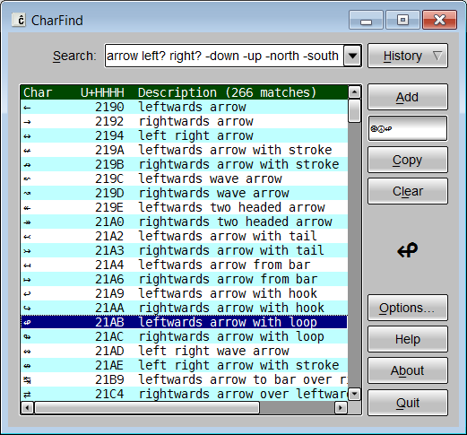

# CharFind

CharFind is an application for finding Unicode characters written in
Rust/FLTK.

Tested on Linux and Windows.

`charfind.exe` *is a precompiled Windows binary that should run on any
64-bit version of Windows* (1.9MB; MD5 9431b0cf8bf5a7e2865ad9f39dba83fe)

## Dependencies

Rust; see Cargo.toml for third-party crates.

## License

GPL-3.0.

## Other Free Software

[www.qtrac.eu](https://www.qtrac.eu/sitemap.html#foss).
